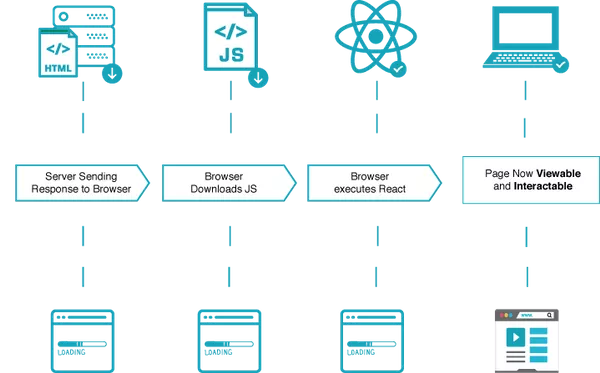
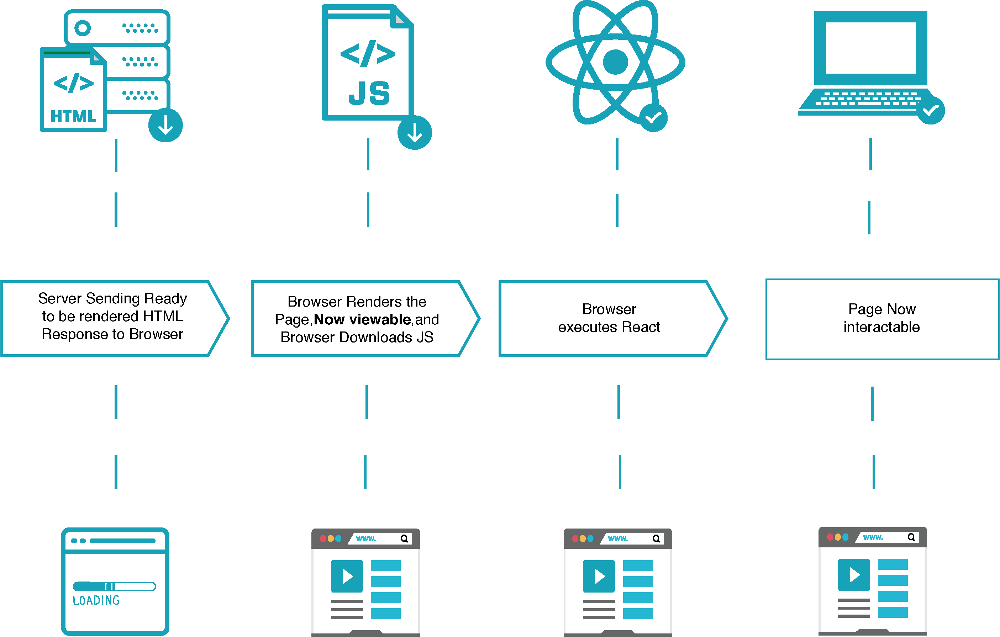

# Server-side Rendering (SSR)

### What is it?

* Server-side rendering (SSR) is a technique for rendering web content on the server-side, i.e., before the page is sent to the client.

* This is in contrast to client-side rendering, where the HTML is generated on the client-side, using JavaScript to render content in the browser.

### How does it work?

1. **Client’s HTTP request** – When the user enters the URL into the browser’s address bar, it establishes an HTTP connection with the server, then sends the server a request for the HTML document.
2. **Data fetching** – The server fetches any required data from the database or third-party APIs.
3. **Server-side pre-rendering** – The server compiles the JavaScript components into static HTML.
4. **Server’s HTTP response** – The server sends this HTML document to the client.
5. **Page load and rendering** – The client downloads the HTML file and displays the static components on the page.
6. **Hydration** – The client downloads the JavaScript file(s) embedded into the HTML, processes the code, and attaches event listeners to the components. This process is also called hydration or rehydration.

### SSR Disadvantages

* The application is divided into server and client. That is, we essentially have 2 applications. 
  * This separation should be minimal, otherwise supporting such an application will be difficult.
* can be costly and resource-intensive, as the server takes on the full burden of rendering content for users and bots.
* while rendering static HTML server-side is efficient,
rendering bigger, more complex applications server-side can increase load times due to the bottleneck:
  * frequent server requests and full page reloads can result in overall slower page rendering
* problems with compatibility: a number of third-party libraries and tools are incompatible with server-side rendering.

### SSR Advantages

* pages load faster (no need to wait for .js and .css files to load),
improving the user experience for those with slow internet connection or outdated devices.

#### SEO
* SPA problem - server sends to client empty HTML page
  * Page is formed after all JS is downloaded
  * Google-bot cannot rank website
* Search engines can easily index and crawl content because the content can be rendered before the page is loaded.
* Webpages are correctly indexed because web browsers prioritize web pages with faster load times.